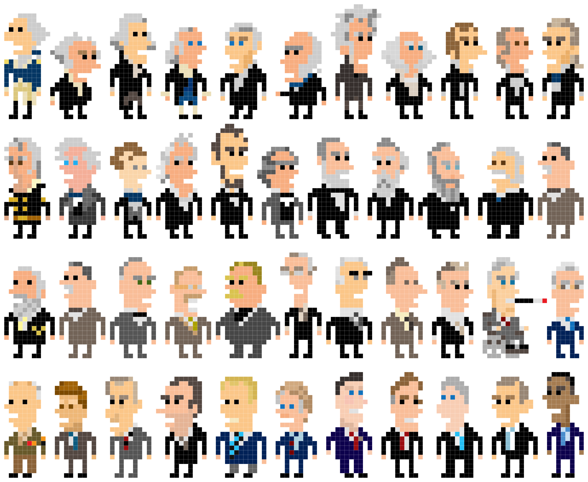
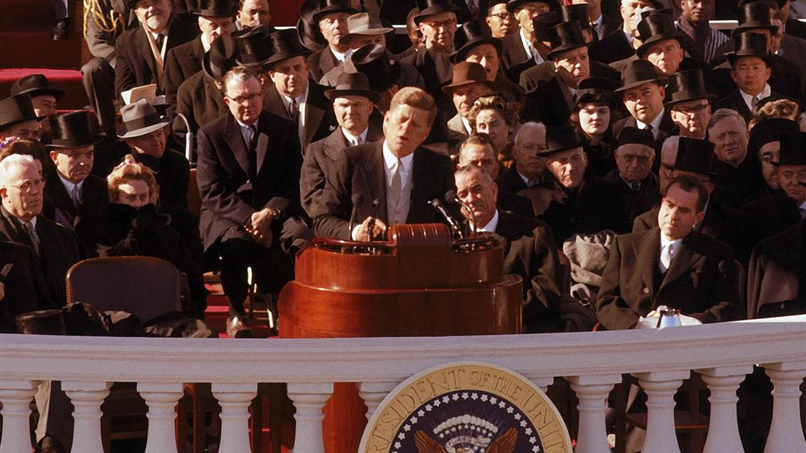

# Spring 2018
# Project 1: What did the presidents say at their inauguation?



### [Project Description](doc/)
This is the first and only *individual* (as opposed to *team*) this semester. 

Term: Spring 2018

+ Projec title: U.S. Presidents and History
+ This project is conducted by qianhui(Karlie)

+ Project summary: The inauguration is considered as one of the most important moments for U.S. Presidents. The newly elected president will be inducted into the president's position. The inaugural speech is the first official speech delivered by the president. 



The purpose is to take close look into the Presidents' Inaugural speeches and find out the associations with the history. I'm also interested to know if the inaugural speeches influence the history in turn. 


Following [suggestions](http://nicercode.github.io/blog/2013-04-05-projects/) by [RICH FITZJOHN](http://nicercode.github.io/about/#Team) (@richfitz). This folder is orgarnized as follows.

```
proj/
├── lib/
├── data/
├── doc/
├── figs/
└── output/
```

Please see each subfolder for a README file.
